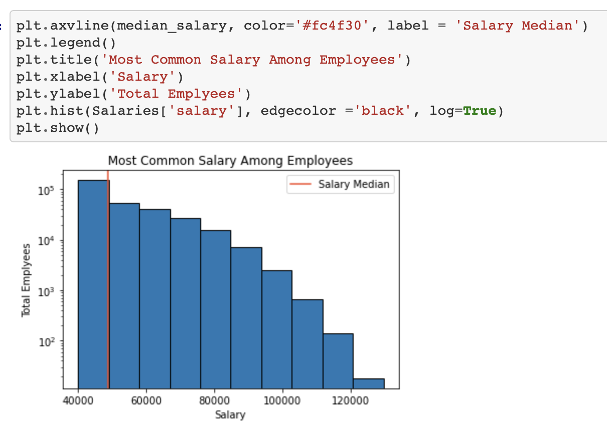
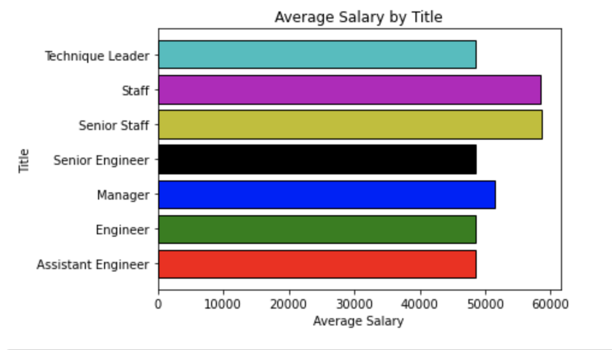

# SQL Project - Employee Database: A Mystery in Two Parts


## Project Summary

It is a beautiful spring day, and it is two weeks since you have been hired as a new data engineer at Pewlett Hackard. Your first major task is a research project on employees of the corporation from the 1980s and 1990s. All that remain of the database of employees from that period are six CSV files.

I have designed the tables to hold data in the CSVs, import the CSVs into a SQL database, and answer questions about the data. In other words, perform:

1. Data Engineering

3. Data Analysis

Note: You may hear the term "Data Modeling" in place of "Data Engineering," but they are the same terms. Data Engineering is the more modern wording instead of Data Modeling.

#### Data Modeling

Inspect the CSVs and sketch out an ERD of the tables. Feel free to use a tool like [http://www.quickdatabasediagrams.com](http://www.quickdatabasediagrams.com).

dept_emp
--
dept_no string
emp_no int fk >- Employees.emp_no


Departments
--
dept_no string fk >- dept_emp.dept_no
dept_name string

dept_manager
--
dept_no string fk >- Departments.dept_no
emp_no int

Employees
--
emp_no int
emp_title_id string fk >- Titles.title_id
brith_date string
first_name string
last_name string
sex string
hire_date string

Salaries
--
emp_no int fk >- Employees.emp_no
salary int

Titles
--
title_id string
title string


#### Data Engineering

* Use the information you have to create a table schema for each of the six CSV files. There are several variables to be specified such as data types, primary keys, foreign keys, and other constraints.

* For the primary keys has to be unique in each column, otherwise create a [composite key](https://en.wikipedia.org/wiki/Compound_key). Which takes to primary keys in order to uniquely identify a row.
* Created tables in the correct order to handle foreign keys.

#### Data Analysis

The completed database consists of:

1. List the following details of each employee: employee number, last name, first name, sex, and salary.

2. List first name, last name, and hire date for employees who were hired in 1986.

3. List the manager of each department with the following information: department number, department name, the manager's employee number, last name, first name.

4. List the department of each employee with the following information: employee number, last name, first name, and department name.

5. List first name, last name, and sex for employees whose first name is "Hercules" and last names begin with "B."

6. List all employees in the Sales department, including their employee number, last name, first name, and department name.

7. List all employees in the Sales and Development departments, including their employee number, last name, first name, and department name.

8. In descending order, list the frequency count of employee last names, i.e., how many employees share each last name.


## Analysis and Result

As we have examined the data, we are overcome with a creeping suspicion that the dataset is fake. To confirm our hunch to make more sense of our analysed data, we decided to take the following steps to generate a visualization of the data, with which we will perform:

1. Import the SQL database into Pandas. This step may require some research. Feel free to use the code below to get started. Be sure to make any necessary modifications for your username, password, host, port, and database name:

   ```sql
   from sqlalchemy import create_engine
   engine = create_engine('postgresql://localhost:5432/<your_db_name>')
   connection = engine.connect()
   ```

* Consult [SQLAlchemy documentation](https://docs.sqlalchemy.org/en/latest/core/engines.html#postgresql) for more information.

* If using a password, do not upload your password to your GitHub repository. See [https://www.youtube.com/watch?v=2uaTPmNvH0I](https://www.youtube.com/watch?v=2uaTPmNvH0I) and [https://help.github.com/en/github/using-git/ignoring-files](https://help.github.com/en/github/using-git/ignoring-files) for more information.

2. A histogram to visualize the most common salary ranges for employees.



3. Create a bar chart of average salary by title.


